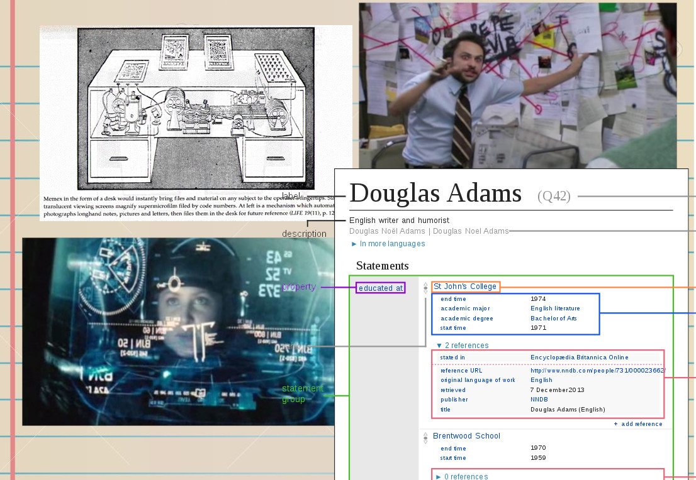

# Note Maps: UX

Status: **draft**

This document follows a workflow more or less based on [UI/UX case study: a
step-by-step guide to the process of designing a pet diet
app][pet-diet-case-study].

[pet-diet-case-study]: https://uxdesign.cc/ui-ux-case-study-a-step-by-step-guide-to-the-process-of-designing-a-pet-diet-app-d635b911b648

## Research what people need

In lieu of interviews, this analysis is based on information that people have
already shared about their own needs for a personal knowledge base. Here are
links to that information along with some highlights from each.

*   [Ask HN: Why do you keep a personal knowledge base?](https://news.ycombinator.com/item?id=17530498)
    *   "absorb, retain, and reference large amounts of 'meaningless' detail,
	trusting to later experience to give it context and meaning."
    *   "being able to have control over an internally oriented structure that
	allows for this process of accepting, selecting, absorbing, checking,
	retaining, and rejecting information."
    *   "give it a structure I remember and can travel into, because I chose
	how to organize it over a very long period of time."
    *   "Recording and crystallizing ideas"
    *   "committing ideas to (virtual) paper helps unburden them from one's
	active memory."
    *   "I'm looking for a way to turn that unfocused research into something
	productive, and it's a tough problem to solve."
    *   "Don't use the online services to store your personal information!"
    *   "to forget less of what I learn every day."
    *   "I won't lose the data and time because some webservice thing went
	down/changed business models/lost interest."
    *   "practice your own judgement on what is worth remembering and what is
	not."
    *   "If I don't keep track of links to articles, comments and research, I
	get dismissed a lot as crazy, not knowing what the hell I am talking
	about, etc."
    *   "get more projects done."
*   [Designing a Personal Knowledgebase](http://www.acuriousmix.com/2014/09/03/designing-a-personal-knowledgebase/) and the ensuing [HN discussion](https://news.ycombinator.com/item?id=8270759).
    *   "I lack an easy and effective system for capturing and recording my learning."
    *   "All in one place"
    *   "Non-proprietary (open source) file formats"
    *   "Ability to accept various kinds of input (text, video, audio, etc.)"
    *   "Linkability"
    *   "Semi-automated input and organization"
    *   "Searchable"
    *   "Multiple organization schemes"
    *   "Web-based" ... "accessible to other people"
    *   "Accessible and operable via Graphical (GUI) and Command-Line interfaces"
    *   "Cross platform"

## Describe a typical user

*   Background
    *   Has studied a lot, and has forgotten a lot too.
    *   Has already tried a few approaches to personal knowledge management.
    *   Works (or hobbies) in a field that requires quickly and continuously
	learning a lot of detailed information.
    *   Is concerned about privacy and data ownership.
*   Habits
    *   Studies topics of interest by reading digital content, listening to
	podcasts, and watching videos.
    *   Takes notes while studying, or else tries or wishes to do so.
*   Difficulties
    *   Soon forgets most of what has been studied.
    *   Notes tend to be scattered, often lost, and rarely reviewed.
*   Goals
    *   Write and revise notes in a single trustworthy system.
    *   Keep notes private and secure.
    *   Share some notes with other people.
    *   Review notes regularly.

## Describe a user journey for that typical user

1.  Thinks: "I just found something interesting and want to remember it later." 
    Does: write a note on the nearest note taking system: a paper journal, a
    text file, a document, a note taking app, just whatever's closest. 
    Feels: uncertain.
1.  Thinks: "Oh, I remember something about this topic! Something like... X." 
    Does: not find the note, but recalls a fragment of the idea, a few
    keywords, nothing useful. 
    Feels: powerless.
1.  Thinks: "I need to know everything in this set of notes." 
    Does: try to read through all the notes again, but not all the way through:
    it's exhausting. 
    Feels: tired.

## Jobs To Be Done

*   When I learn something interesting, I want to record it so I can find it
    later.
*   When I have a question I think I've answered before, I want to find the
    answer in my notes so I can answer my question easily.
*   When I have a responsibility that requires knowing more than I do, I want
    to review my notes regularly so I can remember them later without looking
    them up again.

## User Flowchart

This is just pseudo-graphviz, not necessarily syntactically correct, to be
refined later.

```
launch_app_first_time -> introduction -> create_topic_map;
launch_app -> create_topic_map -> review_topic;
launch_app -> select_topic_map -> review_topic;
review_topic -> add_note;
review_topic -> edit_note;
```

## Sketches

There are sketches in a few places; for now this section just describes a few
pieces.

When there are no topic maps, show the blank list and the FAB to get started.
Also show friendly text in the middle with an arrow toward the FAB, or else
just animate the FAB, to help get started.

Opening a topic map simply navigates to a screen focused on the topic within
the topic map that reifies the topic map.

Notes about a topic are presented similar to paragraphs of text in a document
about that topic. Editing those notes follows a similar flow. When there are no
notes, there is implicitly a single blank note to receive text input.

Links to related topics are displayed below a topic's notes, with a clear
distinction. Related topics may be displayed in summary form, including their
names and notes inline. Tapping a related topic navigates to that topic.

## Wireframes

Wireframes are being developed with the help of Flutter's PlaceHolder widget.

## Storyboard

TODO: describe how the app will be used in the context of a person's day to day
life.

## Visual Research

### Inspiration board



### Iteration

TODO: describe a few design possibilities.

### Color Palette

TODO: choose a theme color.

### Typography

Using custom fonts brings added complexity, including uncertainty about which
characters are supported. Note Maps will use the default typeface.

### Icons & Illustrations

I don’t think we want custom icons… maybe?
Illustrations might be good though. Backgrounds.

### Naming & Logo

The name is "Note Maps", though there's no reason it has to stay that way.

TODO: design a logo.

### Micro-interactions & Animation

It's possible to hint at a larger 2D arrangement of topics in the way that
screen transitions are animated. Since poppping navigation back to a previous
topic will often mean moving to a broader topic, animations might assume a tree
rooted at the topic map's central topic, using vertical sliding for movement up
and down this tree. Likewise, a side-to-side animation when traversing topics
that are "siblings" in this tree.

## Final Design

Iterations here will be included as screenshots in the README.

## Next Steps

*   Usability tests
*   Improved flows
*   Future features
